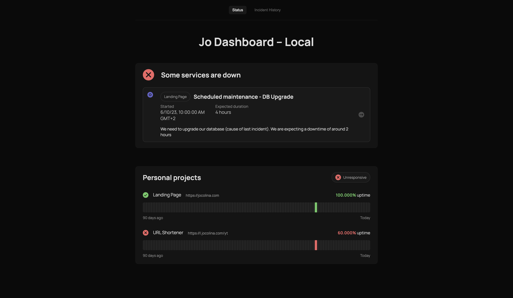
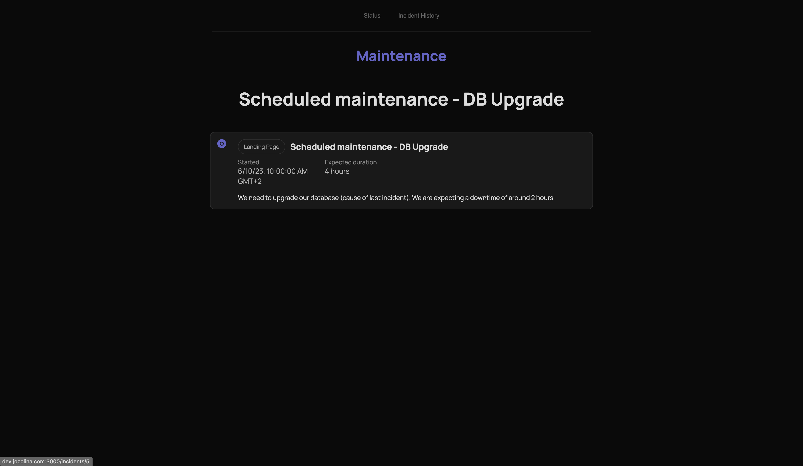
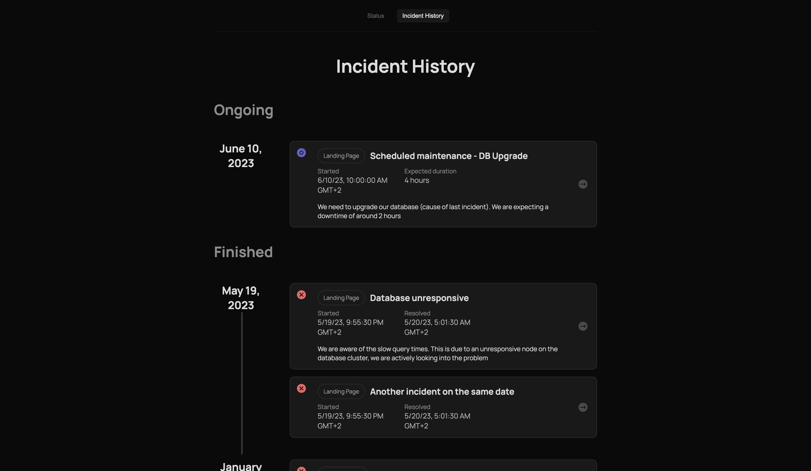
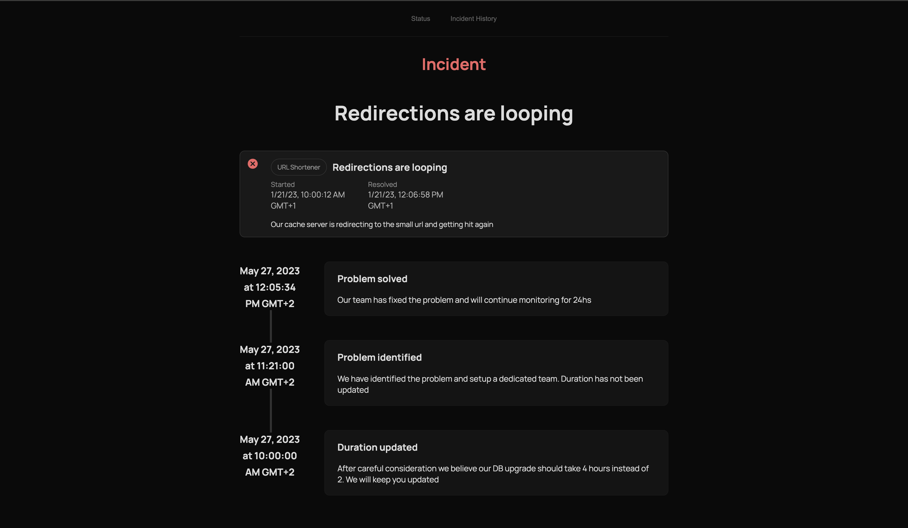
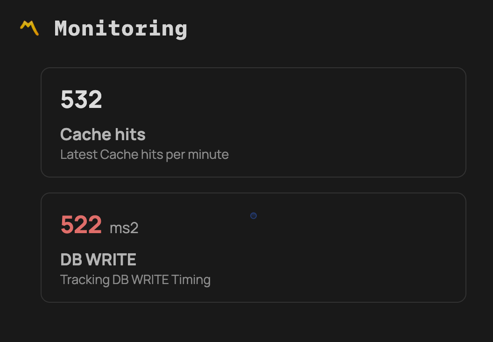

# Ping
A simple status page built over Cloudflare Workers, D1 and Vercel (Next.js 13).

Since this project started as a way to test new tech, it is not very tidy or properly split into components,
but it works nicely!

It has some nice little features:

## Features
- Host dependent
> For single developers and startups, only deploy once! You can configure multiple `page`s depending on host and assign monitors to each
- Extremely fast, built on Cloudflare Workers, Vercel + React server components, and Cloudflare D1.
- Configurable. Monitors accept special configurations to decide how to run them (only http for now) and when to create automatic incidents
- Schedulable maintenance pages

### Planned features (no date set)
- Heartbeat monitors
- Configuration page (OAuth & Basic HTTP auth)

## Screenshots

#### Landing page

#### Maintenance page

#### Incident history

#### Incident updates

## Why does this project exist ?
I wanted to test some new tech, and ended up deciding on a status monitor, because it allowed
me to test them all at the same time:
- Next13 + Server Components
- Cloudflare D1
- NodeJS's own test runner
- Turborepo

## Understanding apps & components
This repo is divided in 3 different components
- `pinger`: Is what does the actual monitoring, reads/writes to Cloudflare D1
- `front`: Is your status page written on Next.js 13
- `api`: Is the management API and used by front-end

There is also a package called `db`. This package is shared between `pinger` and `api`
to read/write from the database. It is a small wrapper over D1's API to simulate an ORM.

## Embeds
The app also allows you to call any "page" via the `/embed` link

Ex: `https://example.com/embed/my-page`

These are special pages where the background is transparent and there is no page title nor menu.
They allow you to embed your monitors/performance trackers in different pages.

Here's an example in Notion:

<pre>
Back of the envelope calculation for disk size

* 1 monitor ~= 250B
* 1 check ~= 215B (max 1min)

Average config:
* 6/7 products & internal stuff
* 3/4 monitors per product
* => 28 monitors total

@ 1 check/min
1y of checks = 60 * 24 * 365 = 525600 checks
=> 113 MB for 1 monitor
=> 3GB for 28 monitors

@ 1 check/10min
6 checks/h
144 checks/day
52560 cehcks/year
=> 11 MB for 1 monitor
=> 308MB for 28 monitors

@ 1 check / 30min
2 chekcs / h
48 checks / day
17 520 checks/year
=> 4.38 MB for 1 monitor
=> 122.64 MB for 28 monitors

Requirements
4GB disk space @ 1 check / min
500MB disk space @ 1 check / 10min
150 MB disk space @ 1 check/ 30min

As of today (2023-06-11) D1 only supports 100MB of data.
</pre>
